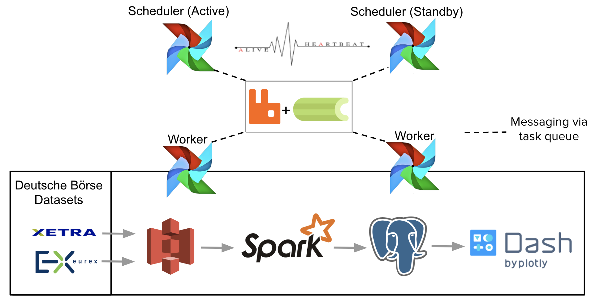

# Table of Contents
1. [Author](README.MD#author)
1. [Introduction](README.MD#introduction)
1. [Motivation](README.MD#motivation)
1. [Fault-Tolerant Airflow](README.MD#fault-tolerant-airflow)
1. [Requirements](README.MD#requirements)
1. [How to Run?](README.MD#how-to-run?)
1. [Data Pipeline](README.MD#data-pipeline)
1. [Visualization](README.MD#visualization)
1. [Test Cases](README.MD#test-cases)
1. [Directory Structure](README.MD#directory-structure)
1. [Directory Structure](README.MD#directory-structure)
1. [Fault-Tolerant Airflow](README.MD#fault-tolerant-airflow)
1. [Data Pipeline](README.MD#data-pipeline)


## Author
This code has been developed by Yagiz Kaymak using Python 2.7 as an Insight Data Science project.
The code is also accessible online as a Github repo:
https://github.com/yagizkaymak/fault-tolerant-airflow

February, 2019

## Introduction
This Python code implements a fault-tolerant Apache Airflow architecture and tested the failure scenarios on a
fully functional data pipeline consisting of AWS S3 -> Spark Batch Processing -> PostgreSQL.

Apache Airflow is a platform to programmatically author, schedule and monitor workflows (https://airflow.apache.org/).
Airflow can automate any workflow (e.g., a data pipeline) by using a Python script that
creates a Directed Acyclic Graph (DAG) (https://en.wikipedia.org/wiki/Directed_acyclic_graph) of tasks.
If one task (e.g. Task2) is dependent on the completion of another task (e.g., Task1) these tasks
can be represented as Task1 -> Task2 as a DAG. This means that Task2 can not run before the completion of Task1.

## Motivation
Apache Airflow employs and one or multiple workers that run the tasks of DAGs, and one scheduler
that orchestrates and schedules the tasks that are run by workers.
Airflow can be setup in single-node mode, where the scheduler and all workers run on the same machine.
Alternatively, Airflow can be setup in cluster mode, where the scheduler and workers can be distributed over
a number of instances/machines to provide fault tolerance for workers.
In both setup, there is __only one__ scheduler that orchestrates everything, which may be brittle for single point of
failure. In case of a scheduler failure, all workflows stall and a manual recovery is needed.

## Fault-Tolerant Airflow
Fault-tolerant Airflow architecture spins up two schedulers running on different machines to provide fault-tolerance.
One scheduler is in active and the other one is in standby mode to prevent duplicate job submissions.
These two fault-tolerant schedulers are synced via a periodic heartbeat message to see if the remote scheduler is active.
Both fault-tolerant schedulers are connected to a common database to simply store relevant information, such as active scheduler,
active backup scheduler, and the timestamp of the last heartbeat message.
If the active scheduler fails/crashes, the backup scheduler automatically takes over by detecting the absence of a heartbeat message
for sometime.
The fault-tolerant Airflow architecture provides fault-tolerance even if the machine that runs
the active scheduler crashes and becomes unresponsive.

## Requirements
This project requires __Apache Airflow__ (https://airflow.apache.org/) installed on all the machines to run Airflow in cluster mode.

This project also requires __RabbitMQ__ as the task queue to enable communication among scheduler(s) and worker nodes,<br> __Celery__ task executor to allow Airflow to run in cluster mode, and<br>
__PostgreSQL__ to be used by Airflow as the metadata database.
Therefore, all  __RabbitMQ__, __Celery__, and __PostgreSQL__ must be installed first to run this project.

You can use __anaconda__ (https://www.anaconda.com/) environment to let anaconda resolve and install all the dependencies required for Airflow.

If you have anaconda installed on the machine that you are going to install Apache Airflow you can run __one of the following__ commands:
```bash
conda install -c conda-forge airflow```
or
```bash
conda install -c conda-forge/label/cf201901 airflow
```

__Note:__ If you have anaconda, RabbitMQ, Celery, and PostgreSQL can be installed, as follows:

```bash
conda install -c conda-forge rabbitmq-server
conda install -c conda-forge celery
conda install -c anaconda postgresql
```

If you do not have anaconda installed, you can use __pip__ to install Apache Airflow, RabbitMQ, and Celery by running the following commands:

```bash
pip install apache-airflow
pip install rabbitmq
pip install Celery
```

Please refer to the following links for installation details of RabbitMQ, Celery, and PostgreSQL packages on Ubuntu/AWS if you do not use anaconda environment:

https://medium.com/a-r-g-o/installing-apache-airflow-on-ubuntu-aws-6ebac15db211

https://vujade.co/install-apache-airflow-ubuntu-18-04/

If you experience any of the issues below as you install Airflow, please run the corresponding command:

If you create a role as __ubuntu__ for PostgreSQL and if you get an error "This role does not have login privileges" you can run the following command:<br>
```bash
ALTER ROLE ubuntu WITH LOGIN;
```

If you see an error like,<br>
__Command "python setup.py egg_info" failed with error code 1 in /tmp/pip-install-WyYWSY/apache-airflow/__

please run
```bash
sudo AIRFLOW_GPL_UNIDECODE=yes pip install apache-airflow[all]
```

If you see an error like

__Command "/usr/bin/python /usr/local/lib/python2.7/dist-packages/pip/_vendor/pep517/_in_process.py get_requires_for_build_wheel /tmp/tmpB9juKF" failed with error code 1 in /tmp/pip-install-GXKMj1/pendulum__

please run

```bash
sudo pip install --no-use-pep517 pendulum==1.4.4
```

If pendulum fails please run
```bash
sudo pip install -U setuptools
```

For the installation details of RabbitMQ on Ubuntu 16.04 you can follow the link below

https://www.vultr.com/docs/how-to-install-rabbitmq-on-ubuntu-16-04-47

If all these packages is up and running, you can configure Airflow to run


## How to Run?
Please run __run.sh__, which is located in the main folder of the project, on all machines that runs Airflow.

__run.sh__ bash script will reset the metadata tables of Airflow, initialize new ones, copy the DAG that runs the [Data Pipeline](README.MD#data-pipeline) to Airflow's dags folder, and copies the database credentials to __fault-tolerant-airflow/src/dags__, __fault-tolerant-airflow/src/spark__, and __fault-tolerant-airflow/src/ft_airflow__ folders.

In order to run the fault-tolerant-airflow process please run
```bash
python ft_airflow.py
```
in the __src/ft_airflow__ folder of the project for each fault tolerant Airflow scheduler instance.

## Data Pipeline
In order to test the Airflow-scheduler failure scenarios, a fully functional data pipeline that is
daily scheduled and orchestrated by the fault-tolerant Airflow is constructed.
The steps of the data pipeline are as follows:

*'Deutsche XETR Public Dataset' -> AWS S3 -> Spark Batch processing -> PostgreSQL*

This data pipeline is represented as a DAG in Airflow as follows:

*Ingest data from Deutsche XETR public dataset and store it in AWS S3 ->
Perform batch processing to calculate daily average stock prices and temporarily store the daily
average prices in a csv file in S3 ->
Detect if the daily csv file created and store the results in PostgreSQL if the file exists*


Figure 1 visualizes the implemented pipeline and the fault-tolerant architecture of Airflow.


Figure 1: *Data pipeline and the architecture of fault-tolerant Airflow*

Note that each task (including the database store task) in the DAG is idempotent
(https://en.wikipedia.org/wiki/Idempotence),which means it can be repeated
without changing the result beyond the initial application.


## Visualization
The results of the calculated daily average stock prices are visualized on
__www.faulttolerantairflow.com__ using Dash app by Plotly.
On the same webpage, the status (i.e., ON - OFF) of the active and backup schedulers, and the
timestamp of the last heartbeat.
Moreover, the same web site has a button allowing to terminate/kill the active Airflow scheduler process.
Stopping the instance that runs the active scheduler is not implemented on the web site for security reasons.

## Test Cases
Two test cases exist to test the fault-tolerance of the developed system:
1. Airflow-scheduler process termination
2. Machine that runs Airflow scheduler crashes

The first test case can be run using the 'Terminate Active Scheduler' button on www.faulttolerantairflow.com.
The second test case requires to send a stop-instance signal to the working instance where the active scheduler
is running.


## Directory Structure
* 'src' directory includes the source files within three sub-directories as 'dags', 'ft_airflow', and 'spark'
  * 'dags' directory includes the DAG to be scheduled by Airflow
  * 'ft_airflow' directory includes the Python scripts for fault-tolerant airflow implementation
  * 'spark' directory includes the PySpark script for batch processing
* 'webapp' directory includes the Dash web app for visualization
